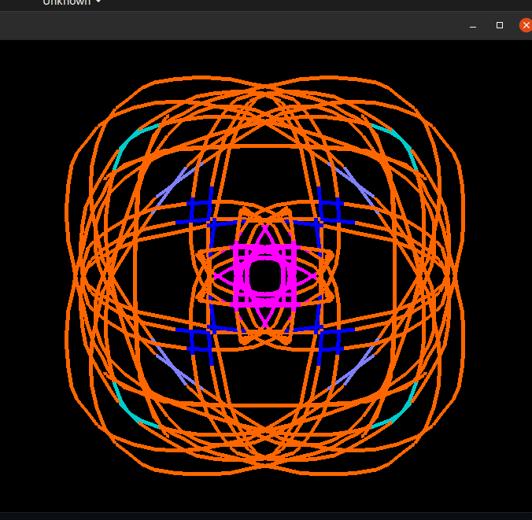
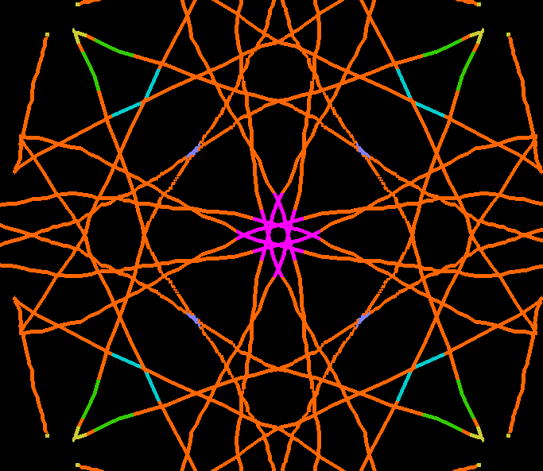
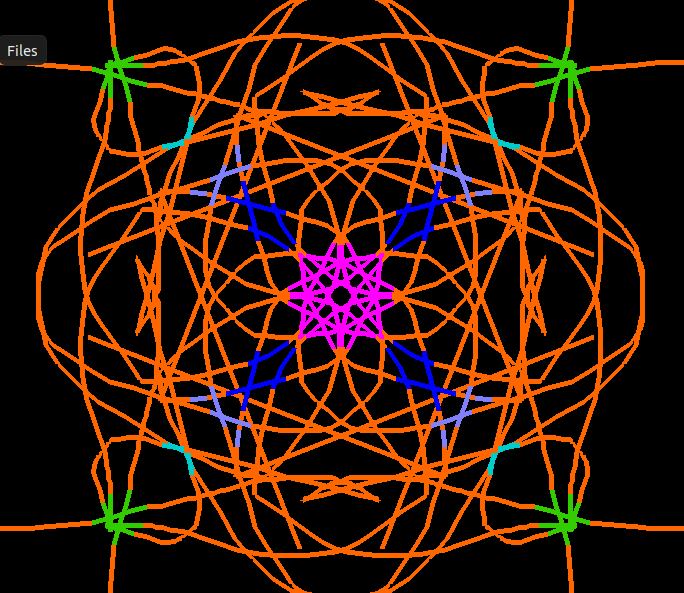
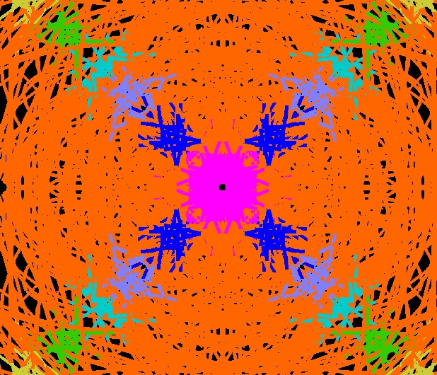

# kaleidoscope-views-Generation

Welcome to Kaleidoscope Views Generation! This project is designed to generate beautiful and mesmerizing kaleidoscope views using openGl in C programming language.   

It is computer graphics project, here I use glut libraries . For coding purpose I use C language. following are the images of kaleioscope pattern generation .
Here's a brief overview of the project:

### Installation
To use Kaleidoscope Views Generation, you'll need to install GLUT libraries:

### Contributing
If you'd like to contribute to Kaleidoscope Views Generation, please fork the repository and submit a pull request.

### License
Kaleidoscope Views Generation is licensed under the MIT License. See the LICENSE file for more information.

### Contact
If you have any questions or comments about Kaleidoscope Views Generation, please contact us at devkatevaibhav04@gmail.com.

## outputs  

  

  

  

